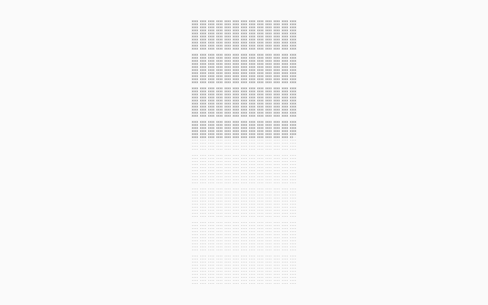
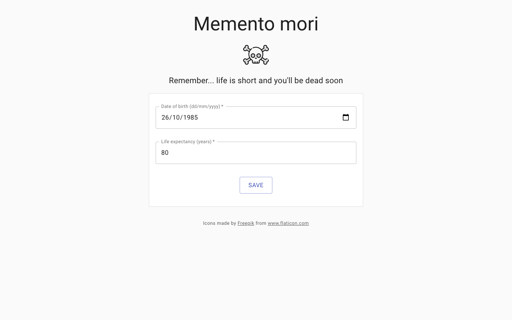

# Memento Mori 

Memento mori is an open source Chrome extension to show a life calendar as the "New tab" page in Chrome.

## New tab page
Every time a new tab is opened in Chrome the life calendar will be shown.

## Options page
The options page allows configuration of date of birth and life expectancy to customize the life calendar.

